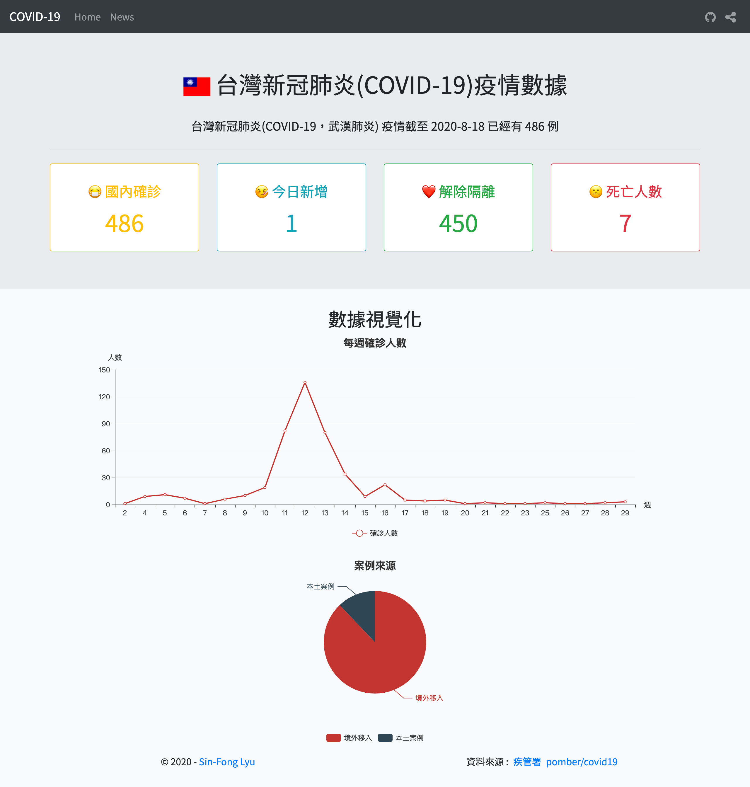

<p align="center">
  <a href="https://kingispeak.github.io/tw-covid-19/" target="_blank">
    
  </a>
</p>
<p align="center">
  <a href="https://travis-ci.org/kingispeak/tw-covid-19">
  
  </a>
</p>
<h1 align="center">台灣新冠肺炎(COVID-19)疫情數據</h1>
台灣新冠肺炎(COVID-19)疫情數據視覺化呈現，資料來源：

1. <a href="https://data.gov.tw/dataset/118038" target="_blank">
   衛生福利部疾病管制署
   </a>
2. <a href="https://github.com/pomber/covid19" target="_blank">https://github.com/pomber/covid19</a>

## Demo



## Live Demo

1. https://gracious-davinci-4e012c.netlify.app/

2. https://kingispeak.github.io/tw-covid-19/

## Project setup

```
npm install
```

### Compiles and hot-reloads for development

```
npm run serve
```

### Compiles for development

```
npm run build
```

### Compiles and minifies for production

```
npm run build production
```

### Run E2E Tests

```
npm run test:e2e
```

### Lints and fixes files

```
npm run lint
```

## Docker

Build docker image and start a container with the following command.

```
docker build -t tw-covid-19:1.0 .`
docker run -d --name vue-app -p 8080:80 tw-covid-19:1.0`
```

Navigate to http://localhost:8080, and you should now see website.
